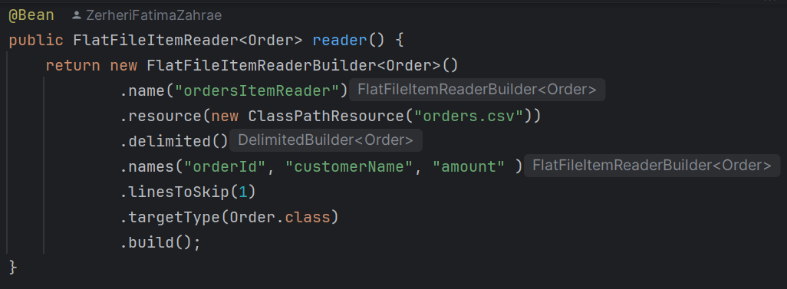

# Spring Batch Job : Traitement de Commandes

## Objectif
Ce projet a pour but de développer un job Spring Batch qui traite une liste de commandes provenant d'un fichier CSV, applique une remise de 10% sur le montant de chaque commande, puis écrit les commandes mises à jour dans une base de données HSQLDB.

## Fonctionnalités
- **Lecture du fichier CSV** : Le fichier contient des commandes avec les colonnes suivantes :
    - `orderId` : Identifiant de la commande
    - `customerName` : Nom du client
    - `amount` : Montant de la commande
- **Transformation des données** : Une remise de 10% est appliquée sur le montant de chaque commande.
- **Insertion dans la base de données HSQLDB** : Les commandes mises à jour sont insérées dans une base de données HSQLDB.
- **Affichage des commandes insérées** : Une fois le job terminé, les commandes insérées dans la base de données sont affichées.

## Structure du projet
Le projet contient les composants suivants :
- **Fichier CSV (orders.csv)** : Contient les données des commandes initiales.
  

- **FlatFileItemReader** : Composant permettant de lire les données depuis le fichier CSV.
  

- **Processor** : Applique une remise de 10% sur le montant de chaque commande.
  

- **ItemWriter** : Insère les commandes mises à jour dans la base de données HSQLDB.
  
- 
- **JobCompletionNotificationListener** : Affiche les commandes insérées après la fin de l'exécution du job.
  
- 
## Resultat


## Prérequis
Avant de commencer, assurez-vous d'avoir les éléments suivants :
- **Java 21** ou version ultérieure
- **Maven 4.0.0** ou version ultérieure
- **IDE compatible avec Spring Boot** (ex. IntelliJ IDEA)
- **Base de données HSQLDB**

## Installation et Exécution

1. **Cloner le projet**
   Pour récupérer le projet, utilisez la commande suivante :
   ```bash
   git clone https://github.com/ZerheriFatimaZahrae/SpringBatchApp.git
